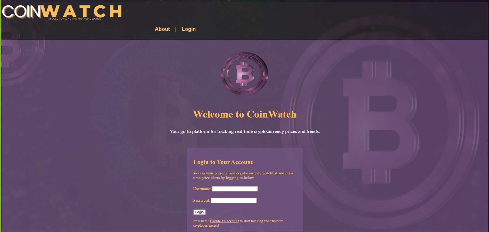
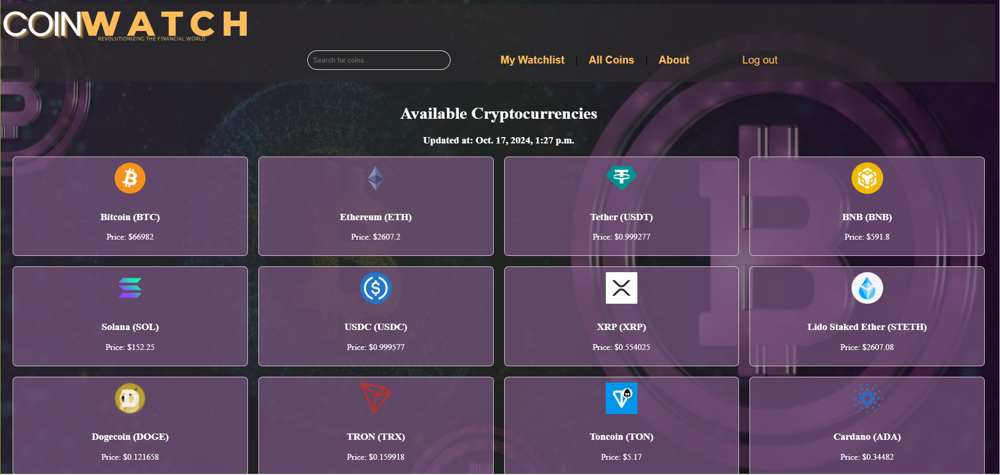

# CoinWatch

CoinWatch is a platform to track live cryptocurrency prices, view historical data, and manage a personalized watchlist. Powered by the CoinGecko API, it uses Django for the backend and HTML, CSS, and JavaScript for the frontend.

## Screenshots 

*Above is a screenshot of the application's landing page.*

*Above is a screenshot of the application's all coins page.*

## Visit our app
You can visit our app here: https://coinwatch-26f35a9e73f9.herokuapp.com/

## Features

- **User Authentication:** Sign up, log in, and manage accounts.
- **Watchlist:** Add/remove cryptocurrencies to/from a personal watchlist.
- **Live Data:** Fetch real-time prices and volume data from CoinGecko.
- **Historical Data:** View market cap, volume, and price changes.
- **Live Search:** Filter coins in real-time.
- **Responsive Design:** Mobile-friendly interface.

## Technologies Used

- **Frontend**: 
  -  
  - 
  -  
- **Backend**: 
  - 
  - 
  - CoinGecko
- **Database**: 
  -  
- **Version Control**: 
  - 
  - 
- **Development Tools**: 
  - 
  - Lucid Chart
  - 
  - 
  - 
- **Debugging & Resources**:
    - [Google](https://img.shields.io/badge/Google_chrome-4285F4?style=for-the-badge&logo=Google-chrome&logoColor=white)
    - 
    - CoinGecko Docs
    - Canvas
    - ChatGPT

## Future Features

- **Price Alerts:** Notifications for custom price thresholds.
- **Stop Gap Alerts:** Warnings for significant market changes.
- **Crypto Wallet Integration:** View holdings in real-time.
- **Watchlist Sorting & Favorites:** Sort by preference, mark favorites.
- **Profile Customization & News Feed:** Personalized settings and latest industry news.

## Credits

This project was a collaborative effort by the following team members, with each contributing equally to its success:

- **Brittany Herbert**
- **DeShae Butler**
- **Ian Ruiz**
- **Kevin Dublin**

We worked together throughout the development process, sharing responsibilites and providing mutual support to bring CoinWatch to life.

We would like to extend our thanks to our instructors who supported us throughout this project.

## Contributing 

Feel free to contribute to CoinWatch by submitting a pull request. Please ensure your changes align with the project goals and have been tested.